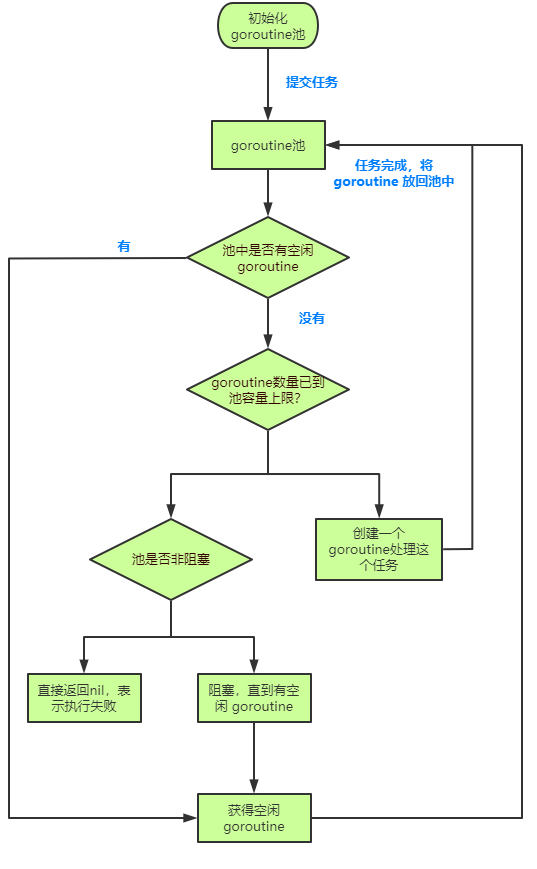

## goroutine 线程池
This is a tiny goroutine workerpool.
> reference:
> bigwhite  
> [fasthttp](https://github.com/valyala/fasthttp/blob/master/workerpool.go)
> [ants](https://github.com/panjf2000/ants)


## workerpool 主要功能
- pool 创建与销毁
- 接收 `func()` 类型任务
- goroutine 复用
- goroutine 分配任务
- 可配置超时时间，任务执行超时自动退出


##  执行流程
1. 初始化 goroutine 池；
2. 提交任务给 goroutine 池，检查是否有空闲的 goroutine：
	- 有，获取空闲 goroutine
	- 无，检查池中的 goroutine 数量是否已到池容量上限：
		- 已到上限，检查 goroutine 池是否是非阻塞的：
			- 非阻塞，直接返回nil表示执行失败
			- 阻塞，等待 goroutine 空闲
		- 未到上限，创建一个新的 goroutine 处理任务
3. 任务处理完成，将 goroutine 交还给池，以待处理下一个任务



## option 可选参数 （functional option）
> https://commandcenter.blogspot.com/2014/01/self-referential-functions-and-design.html

使用函数式的方式包装可选参数，返回闭包函数
```go
func WithBlock(block bool) Option { // 调用是否阻塞，若启用当 woker 不足时会等待；若不启用，分配该任务直接返回错误
	return func(p *Pool) {
		p.block = block
	}
}

func WithPreAllocWorkers(preAlloc bool) Option { // 是否预创建 worker，若启用会预先分配 cap 数量的 woker
	return func(p *Pool) {
		p.preAlloc = preAlloc
	}
}
```